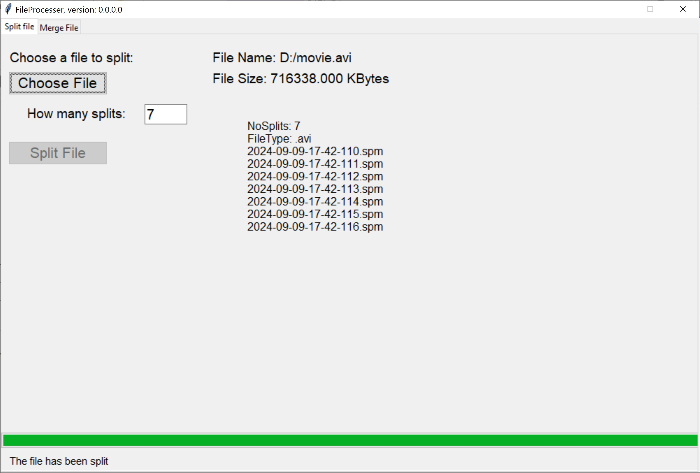

# FileProcessor
### First version 0.0.0.0
1) Split any file into a number of segments.
2) Merge the segments of a file into a single file.
3) This application is completely free. 
## This archive includes the executable program, **FileProcessor.exe**, which you should click on to run.
[Download the archive for win64 (Windows 10 and over)](https://drive.google.com/file/d/1PGVP33dFPDykx2ksvI2sGW0HuemaQrco/view?usp=sharing)
---
 *Figure 1: A snapshot of FileProcessor, version 0.0.0.0, while splitting the chosen file.*
---