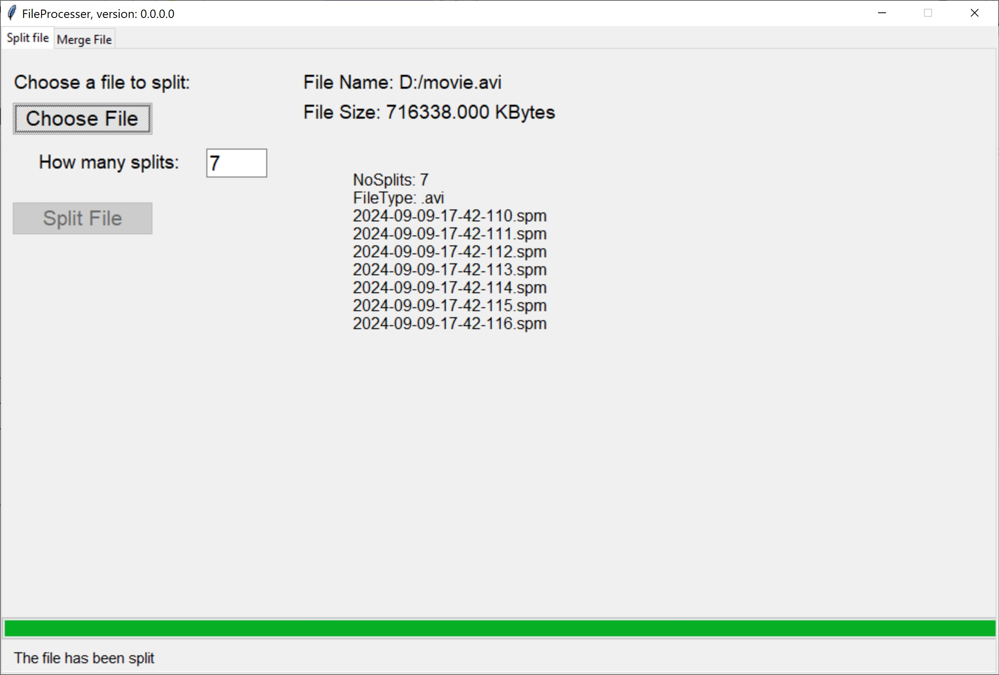
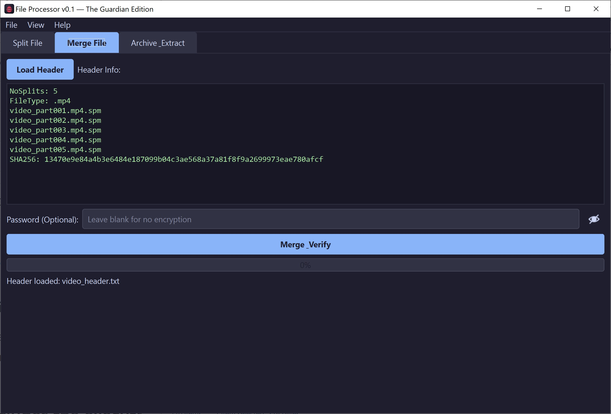

# File Processor — The Guardian Edition

> A fast, threaded, fully-offline desktop tool to **split, merge, compress, extract and encrypt** files — wrapped in an beatiful interface and sealed into a single **Windows** executable.

---

## ⬇️ Download (Windows 10 and over — single offline .exe)

**[⬇ Download FileProcessor v0.1 (.exe) from Google Drive](https://drive.google.com/file/d/1KpG1QohAjULthmrXLBTBhaOujauBQmws/view?usp=sharing)**

- 📦 **One file.** No installation, no Python, no dependencies.
- 🌐 **Fully offline.** She never phones home — everything runs locally.
- ️ If Drive shows a scan warning for large files, click **Download anyway**.

---
<table>
<tr>
<td> 
Figure 1. The snapshot of the File Processor, version 0.0.
</td>
<td>
Figure 2. The snapshot of the File Processor, version 0.1.
</td>
</tr>
</table>

---

## ✨ Features

### 🔪 Split
- Split any file into **2–999 parts** using 10 MB streaming blocks.
- Background `QThread` workers — the GUI **never freezes**, even on huge files.
- Optional **AES-256 streaming encryption** (PBKDF2-HMAC-SHA256, 480k iterations).
- A **SHA-256 "Guardian" hash** is written into the header file with every split.

### 🔗 Merge
- Load (or drag & drop) the `_header.txt` and rebuild the original in one click.
- Automatic **integrity verification**: corrupted parts or a wrong password are detected and reported safely.

### 📦 Archive & Extract
- **Zip** (universal), **Tar.gz** (Linux-friendly), **7z** (maximum density).
- **Extract here (no folder)** mode with a smart **Collision Guard**:
  if files already exist, the app asks before overwriting — and if you decline,
  it loops with you until a safe folder name is found. Your data is never silently destroyed.

### 🎨 Interface
- **Drag & drop** on every tab.
- **Midnight dark theme** & daylight theme (View menu).
- Password **eye toggle** for safe typing.
- Built-in **User Guide (F1)** and **About** dialog.
- **Graceful exit**: running tasks are cancelled safely between chunks when you close the app.

---

## 🧾 Header File Format (`*_header.txt`)

```
NoSplits: <n>
FileType: <.ext>
Salt: <base64>          # only when encrypted
Encrypted: True         # only when encrypted
<part_001 name>
<part_002 name>
...
SHA256: <guardian hash of the original file>
```

Keep the header together with the parts — it is the map *and* the guardian of your file.

---

## 📜 License
MIT — free to use, study, and share. See [LICENSE](LICENSE).

---

## ❤️ Support Us

If File Processor made your midnight a little easier, the most precious gift you can give us is a **star on this repository** ⭐ and sharing her with someone who needs her. 🍁

---

## ❤️ Credits

Designed & developed by **Hamed Shah-Hosseini**

*Made with love with Icon of a pomegranate under S star.* 🍁
